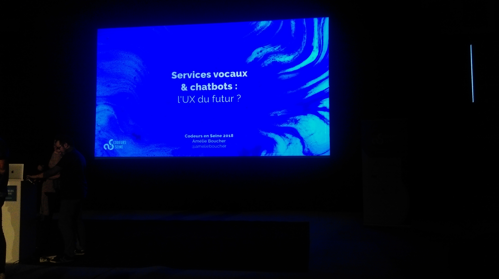

# Résumé conférence Codeur en Seine 2018 Mathieu VANDECASTEELE

## Cartouche d'identification

 - Manifestation : CodeursEnSeine 2018
 - Lieu : Kindarena
 - Conférence : **Service vocaux & chatbots : l'UX du futurs?**
 - Horaire de la conférence : 14h30
 - Durée de la conférence : 50 minutes
 - Conférencier(s) :
   - [Amélie BOUCHER](https://www.linkedin.com/in/amelieboucher/)
 - Audience : ~ 250 personnes
 - Auteur du billet : [Mathieu VANDECASTEELE](https://www.linkedin.com/in/mathieuvdc/)
 - Mots-clés : UX, Chatbots, Enceintes, IOT, services vocaux, Google Home, Alexa, atouts, défauts
 - URL de l'illustration : 
   - Liens annexes : 
     - [UX sur le Gâteau](https://ux-surlegateau.com)
     - [École Centrale de Lille](http://centralelille.fr/)

## Support
 - Lien du support (diapos) présenté en conférence : indisponible
 - Nombre de diapos du support : 32
 - Plan du support :
 
    - Assistants Vocaux et Enceintes connectées
      - Les points positifs sur le plan expérience utilisateur, pourquoi c'est aujourd'hui si populaire ?
      - Les inconvénients de ces technologies.

    - Le cas des Chatbots
      - Les points positifs sur le plan expérience utilisateur, pourquoi c'est aujourd'hui si populaire ?
      - Les inconvénients de ces nouvelles formes d'expériences.
      - Exemples de bons et mauvais Chatbots.

## Résumé

    Aujourd'hui on dénote beaucoup de "buzzwords" liés à l'intelligence artificielle, notamment les notions d' "enceintes intelligentes" ou encore de "chatbots". Depuis les deux dernières années, l'utilisation de ces nouveaux services a considérablement augmenté.
Quels sont les impacts de ces nouvelles technologies sur leurs utilisateurs ? Facilitent-elles réellement les usages ?

    Dans un premier temps, sur la question des assistants vocaux et enceintes intelligentes, ces services se sont naturellement démarqués du fait qu'ils simplifient certains actions : obtenir par exemple des informations et exécuter des actions simples rapidement. L'utilisation de la voix permet aussi de défier l'espace physique, de ne pas avoir besoin de la vision et de minimiser certains efforts.
Pourtant, même si la plupart des utilisateurs souvent ne se contente que d'actions très simples ou s'en servent putôt comme un des "jouets", les assistants vocaux ne sont pas adaptés à toutes les situations et se confrontent à des problèmes réels : utilisation en environnement bruyant ou encore dans le cas d'actions complexes lorsqu'il s'agit d'aller au-delà d'une intéraction avec une seule question et une seule réponse : cela prend notamment du temps, c'est linéaire et il faut souvent répéter plusieurs fois pour arriver à ce que l'on désire vraiment, cela peut-être agaçant. À noter également que par exemple, sur un site e-commerce, l'enceinte ne peut pas remplacer un écran : comment distinguer telle ou telle marque de produit vaisselle si l'on a juste indiqué que nous souhaitions du liquide vaisselle ? L'enceinte ne peut pas dicter tous les produits existants lorsqu'ils sont nombreux et doit donc faire un choix restreint.

    Autre type d'agent conversationnel populaire : les chatbots.
Les chatbots sont facilement identifiés grâce à leur interface similaire à celle des messagerie instantanées, toujours située en bas à droite des sites. Ces chatbots sont très utiles car ils permettent d’entrer en relation avec les utilisateurs, avec un modèle d'interaction ancré dans leurs usages : on incite donc très vite les utilisateurs à utiliser ces derniers et ce sans nécessité d'apprentissage de leur part.
Bien qu'efficaces dans le cas d'un service client, on remarque cependant que beaucoup de chatbots ne servent pas à l'utilisateur : on a des chatbots qui sont plutôt issus d'une blague de programmeur, d'autres trop bavards et oppressants, certains suivent également qu'un arbre de décision et ne présente pas d'enrichissement avec Machine Learning donc on se retrouve vite limité. Si l'utilisateur prend conscience trop vite qu'il parle avec un robot, il changera son attitude avec ce dernier et ce n'est pas le but recherché.

    Pour faire un chatbot efficace, il faut respecter les codes conversationnels fondamentaux des humains sinon cela ne marche pas et autant ne pas investir du temps à développer un chatbot.

    Pour conclure, aujourd'hui le métier de designer revient à designer en 2018 essentiellement ce que l'on ne voit pas et ces deux exemples de services qui sont des opportunités doivent être améliorés pour donner un sens à leur avenir.

## Architecture et facteur qualité

